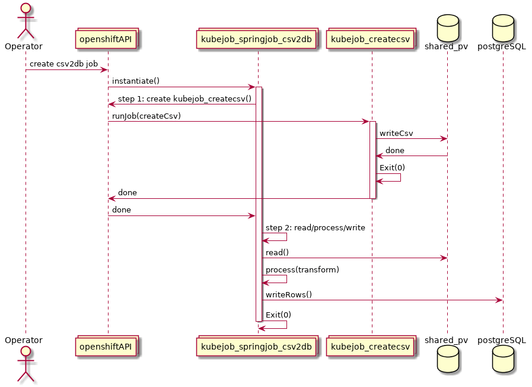

# Orchestrating Jobs on Openshift using Spring Batch and Kubernetes Jobs

This project is to serve as an example on how to run [spring-batch](https://projects.spring.io/spring-batch/) jobs 
along with [kubernetes jobs](https://docs.openshift.com/container-platform/3.9/dev_guide/jobs.html) on Openshift.

The example is a simple extension of the [gs-batch-processing](https://github.com/spring-guides/gs-batch-processing/tree/master/complete) code
where running on minishift we have the following:

- Openshift/Kubernetes Jobs
- Shared Persistent Volumes
- Shared Postgres Database for metadata



## What happens

1. An Openshift Job is created which runs a spring-batch job with the steps below with two parameters (jobFileLocation and batchRun)
2. Step 1 creates a new bash container as an Openshift job that generates a CSV file and places it in a location (on a shared persistentVolume)
3. Step 2 continues the spring-batch job which will read the file, process the file, and pushes the data into the database.

During Step 1 the spring-batch application uses the `OpenshiftJobTasklet` which uses the `fabric8 OpenShiftClient`.  This is what instructs
the cluster to spin up a new Job.

## Setting up the environment

Create a project and install postgres
```
# create the project
oc new-project batch

# create the database
oc new-app postgresql-persistent -p POSTGRESQL_USER=sqladmin -p POSTGRESQL_PASSWORD=sqladmin -p POSTGRESQL_DATABASE=batch

# create the config map for spring batch
oc create configmap batch-config --from-file=openshift/configmap

# create the shared PVC for the files (note this is ReadWriteMany mode)
oc create -f ./openshift/pvc.json

# build this project to build the container image into openshift/minishift
mvn clean package fabric8:build
```

The resulting image will be added to an imagestream

```text
[user@localhost csv2db-batch-ocp]$ oc get is
NAME               DOCKER REPO                              TAGS      UPDATED
csv2db-batch-ocp   172.30.1.1:5000/batch/csv2db-batch-ocp   1.0       8 seconds ago
```

## Running the jobs

Please note that `jobFileLocation` is passed in as a jobParameter and this is actually the location where the csv file will be generated.
The job containers mount the shared persistent volume on `/test`.

Also note the command field:

`command: ["java", "-jar", "/deployments/csv2db-batch-ocp-1.0.jar", "importUserJob", "jobFileLocation=/test/myfile2.csv", "batchRun=2"]`

- importUserJob = the name of the spring batch job
- jobFileLocation=/test/myfile2.csv - name of the file to create/process
- batchRun=2 another jobParameter

Let's create a new job on Openshift:

```text
oc create -f - <<EOF
---
apiVersion: batch/v1
kind: Job
metadata:
  name: csv2db-job-1
spec:
  parallelism: 1    
  completions: 1    
  template:         
    spec:
      containers:
      - name: spring-batch
        env:
        - name: SPRING_CONFIG_LOCATION
          value: /config/batch.properties
        image: 172.30.1.1:5000/batch/csv2db-batch-ocp:1.0
        command: ["java", "-jar", "/deployments/csv2db-batch-ocp-1.0.jar", "importUserJob", "jobFileLocation=/test/myfile1.csv", "batchRun=1"]
        resources:
          limits:
            cpu: 300m
            memory: 512Mi
          requests:
            cpu: 300m
            memory: 512Mi        
        volumeMounts:
        - mountPath: /test
          name: test
        - mountPath: /config
          name: config
      volumes:
      - name: test
        persistentVolumeClaim:
          claimName: spring-batch-claim
      - name: config
        configMap:
          name: batch-config
      restartPolicy: Never
...
EOF
```

Once we run this job, we can see from the container logs that something isn't quite right...

```text
2018-04-30 12:16:35.344  WARN 1 --- [default.svc/...] i.f.k.c.d.i.WatchConnectionManager       : Exec Failure: HTTP 403, Status: 403 - User "system:serviceaccount:batch:default" cannot watch jobs.batch in the namespace "batch": User "system:serviceaccount:batch:default" cannot watch jobs.batch in project "batch"
java.net.ProtocolException: Expected HTTP 101 response but was '403 Forbidden'
	at okhttp3.internal.ws.RealWebSocket.checkResponse(RealWebSocket.java:219) ~[okhttp-3.9.1.jar!/:na]
	at okhttp3.internal.ws.RealWebSocket$2.onResponse(RealWebSocket.java:186) ~[okhttp-3.9.1.jar!/:na]
	at okhttp3.RealCall$AsyncCall.execute(RealCall.java:153) [okhttp-3.9.1.jar!/:na]
	at okhttp3.internal.NamedRunnable.run(NamedRunnable.java:32) [okhttp-3.9.1.jar!/:na]
	at java.util.concurrent.ThreadPoolExecutor.runWorker(ThreadPoolExecutor.java:1149) [na:1.8.0_161]
	at java.util.concurrent.ThreadPoolExecutor$Worker.run(ThreadPoolExecutor.java:624) [na:1.8.0_161]
	at java.lang.Thread.run(Thread.java:748) [na:1.8.0_161]
```

We need to fix this by applying the correct permissions to allow this user to watch pods, and also be able to create jobs in this namespace.

```text
oc delete job/csv2db-job-1
oc policy add-role-to-user edit system:serviceaccount:batch:default -n batch

oc create -f - <<EOF
---
apiVersion: batch/v1
kind: Job
metadata:
  name: csv2db-job-2
spec:
  parallelism: 1    
  completions: 1    
  template:         
    spec:
      containers:
      - name: spring-batch
        env:
        - name: SPRING_CONFIG_LOCATION
          value: /config/batch.properties
        image: 172.30.1.1:5000/batch/csv2db-batch-ocp:1.0
        command: ["java", "-jar", "/deployments/csv2db-batch-ocp-1.0.jar", "importUserJob", "jobFileLocation=/test/myfile2.csv", "batchRun=2"]
        resources:
          limits:
            cpu: 300m
            memory: 512Mi
          requests:
            cpu: 300m
            memory: 512Mi        
        volumeMounts:
        - mountPath: /test
          name: test
        - mountPath: /config
          name: config
      volumes:
      - name: test
        persistentVolumeClaim:
          claimName: spring-batch-claim
      - name: config
        configMap:
          name: batch-config
      restartPolicy: Never
...
EOF
```

We should now see that the appropriate pods are Started, then Run, then Completed.

```text
[user@localhost csv2db-batch-ocp]$ oc get pods
NAME                           READY     STATUS      RESTARTS   AGE
csv2db-batch-ocp-s2i-1-build   0/1       Completed   0          16m
csv2db-job-2-4b5dd             0/1       Completed   0          1m
generate-csv-2-7sbns           0/1       Completed   0          1m
postgresql-1-7r72s             1/1       Running     0          40m

[user@localhost csv2db-batch-ocp]$ oc get jobs
NAME             DESIRED   SUCCESSFUL   AGE
csv2db-job-2     1         1            2m
generate-csv-2   1         1            2m
```


## Checking the meta data

Spring batch stores a bunch of meta data about jobs it runs, we can interrogate the postgres database to see what has been collected.

 

```text
[user@localhost csv2db-batch-ocp]$ oc rsh $(oc get pods -l name=postgresql -o json | jq -r .items[0].metadata.name)
sh-4.2$ psql
psql (9.5.9)
Type "help" for help.

postgres=# \c batch
You are now connected to database "batch" as user "postgres".

batch=# select * from batch_job_instance;
 job_instance_id | version |   job_name    |             job_key              
-----------------+---------+---------------+----------------------------------
               1 |       0 | importUserJob | 7c91866b50620873154bc02c6a5999c7
               2 |       0 | importUserJob | 2338816bf584aa7670a35bd47b11210b
(2 rows)

```

We can see that we have had two job instances created.  Now let's have a look at the step executions:

```text
batch=# SELECT step_execution_id, version, step_name, job_execution_id, start_time, end_time, status FROM public.batch_step_execution;
 step_execution_id | version | step_name | job_execution_id |       start_time        |        end_time         |  status   
-------------------+---------+-----------+------------------+-------------------------+-------------------------+-----------
                 1 |       2 | step1     |                1 | 2018-04-30 12:16:34.419 | 2018-04-30 12:16:35.356 | FAILED
                 2 |       3 | step1     |                2 | 2018-04-30 12:21:05.519 | 2018-04-30 12:21:22.313 | COMPLETED
                 3 |       4 | step2     |                2 | 2018-04-30 12:21:22.371 | 2018-04-30 12:21:22.491 | COMPLETED
(3 rows)
```

Our first job failed, we know why, but we can always have a look at the exit message to give us an idea why...

```text
batch=# SELECT EXIT_MESSAGE FROM public.batch_step_execution WHERE step_execution_id=1;
                                                                                                                exit_message                                                                                       
                         
-------------------------------------------------------------------------------------------------------------------------------------------------------------------------------------------------------------------
-------------------------
 io.fabric8.kubernetes.client.KubernetesClientException: User "system:serviceaccount:batch:default" cannot watch jobs.batch in the namespace "batch": User "system:serviceaccount:batch:default" cannot watch jobs.
batch in project "batch"+
         at io.fabric8.kubernetes.client.dsl.internal.WatchConnectionManager$2.onFailure(WatchConnectionManager.java:189)                                                                                          
                        +
         at okhttp3.internal.ws.RealWebSocket.failWebSocket(RealWebSocket.java:546)                                                                                                                                
                        +
         at okhttp3.internal.ws.RealWebSocket$2.onResponse(RealWebSocket.java:188)                                                                                                                                 
                        +
         at okhttp3.RealCall$AsyncCall.execute(RealCall.java:153)                                                                                                                                                  
                        +
         at okhttp3.internal.NamedRunnable.run(NamedRunnable.java:32)                                                                                                                                              
                        +
         at java.util.concurrent.ThreadPoolExecutor.runWorker(ThreadPoolExecutor.java:1149)                                                                                                                        
                        +
         at java.util.concurrent.ThreadPoolExecutor$Worker.run(ThreadPoolExecutor.java:624)                                                                                                                        
                        +
         at java.lang.Thread.run(Thread.java:748)                                                                                                                                                                  
                        +
 
(1 row)
```

Sure, the message may be untidy via the rsh/shell, but at least we have some good meta data when we are running spring batch jobs to figure out why things didn't work.

We can also confirm that our people table has people in it...

```text
batch=# select * from people;
 person_id | first_name | last_name 
-----------+------------+-----------
         1 | STEPHANIE  | FLETCHER
         2 | CHRISTINA  | MORGAN
         3 | CHRISTINA  | THOMAS
         4 | MOHAMMAD   | FLETCHER
         5 | BILL       | JONES
         6 | OLIVE      | ROBERTS
         7 | DAVID      | BROWN
         8 | BILL       | WILLIAMS
         9 | TOM        | ALUN
        10 | BEN        | GREEN
(10 rows)
```

Let's generate another 10 people via another job/terminal:

```text
oc create -f - <<EOF
---
apiVersion: batch/v1
kind: Job
metadata:
  name: csv2db-job-3
spec:
  parallelism: 1    
  completions: 1    
  template:         
    spec:
      containers:
      - name: spring-batch
        env:
        - name: SPRING_CONFIG_LOCATION
          value: /config/batch.properties
        image: 172.30.1.1:5000/batch/csv2db-batch-ocp:1.0
        command: ["java", "-jar", "/deployments/csv2db-batch-ocp-1.0.jar", "importUserJob", "jobFileLocation=/test/myfile3.csv", "batchRun=3"]
        resources:
          limits:
            cpu: 300m
            memory: 512Mi
          requests:
            cpu: 300m
            memory: 512Mi
        volumeMounts:
        - mountPath: /test
          name: test
        - mountPath: /config
          name: config
      volumes:
      - name: test
        persistentVolumeClaim:
          claimName: spring-batch-claim
      - name: config
        configMap:
          name: batch-config
      restartPolicy: Never
...
EOF

#result:
batch=# select * from people;
 person_id | first_name | last_name 
-----------+------------+-----------
         1 | STEPHANIE  | FLETCHER
         2 | CHRISTINA  | MORGAN
         3 | CHRISTINA  | THOMAS
         4 | MOHAMMAD   | FLETCHER
         5 | BILL       | JONES
         6 | OLIVE      | ROBERTS
         7 | DAVID      | BROWN
         8 | BILL       | WILLIAMS
         9 | TOM        | ALUN
        10 | BEN        | GREEN
        11 | BILL       | FARR
        12 | DAVID      | GREEN
        13 | MATTHEW    | FLETCHER
        14 | RHIAN      | SMITH
        15 | BEN        | ROBINSON
        16 | STEVEN     | GREEN
        17 | GARETH     | LEE
        18 | DAVID      | LEWIS
        19 | JAMES      | DAVIES
        20 | BILL       | THOMAS
(20 rows)

```
Of course, the spring-batch meta data is again updated as appropriate.

## Storage

So what about this storage?  Let's take a look...

```text
# Export the persistent volume attached to our spring-batch-claim
[user@localhost csv2db-batch-ocp]$ oc export pv/$(oc get pv | grep spring-batch-claim | awk '{print $1}')
apiVersion: v1
kind: PersistentVolume
metadata:
  annotations:
    pv.kubernetes.io/bound-by-controller: "yes"
  creationTimestamp: null
  labels:
    volume: pv0092
  name: pv0092
spec:
  accessModes:
  - ReadWriteOnce
  - ReadWriteMany
  - ReadOnlyMany
  capacity:
    storage: 100Gi
  claimRef:
    apiVersion: v1
    kind: PersistentVolumeClaim
    name: spring-batch-claim
    namespace: batch
    resourceVersion: "123237"
    uid: 41dca571-4c70-11e8-994b-525400ec10ef
  hostPath:
    path: /var/lib/minishift/openshift.local.pv/pv0092
  persistentVolumeReclaimPolicy: Recycle
status: {}
```

In this instance I'm using minishift, so we can go and check out the files in the hostPath location...

```text
[docker@minishift ~]$ ls -lah /var/lib/minishift/openshift.local.pv/pv0092
total 16K
drwxrwxrwx.   2 root root 4.0K Apr 30 08:45 .
drwxr-xr-x. 103 root root 4.0K Apr 24 05:02 ..
-rw-r--r--.   1 root root  141 Apr 30 08:21 myfile2.csv
-rw-r--r--.   1 root root  125 Apr 30 08:45 myfile3.csv

```
It can be seen the files are there (as expected).

## References

- [spring-batch](https://projects.spring.io/spring-batch/)
- [gs-batch-processing](https://github.com/spring-guides/gs-batch-processing/tree/master/complete)
- [kubernetes jobs](https://docs.openshift.com/container-platform/3.9/dev_guide/jobs.html)